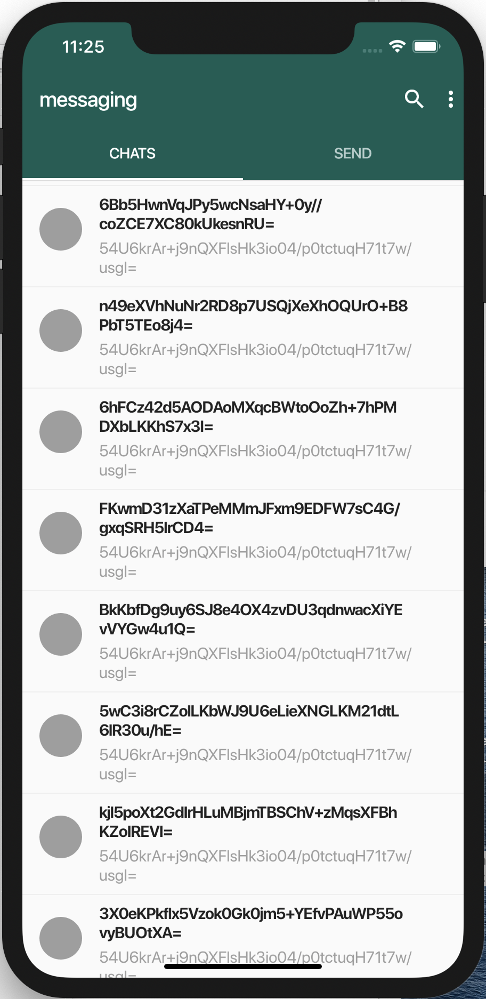

# Nym Mobile Example using the Flutter WhatsAppClone

Building a WhatsApp Clone in Flutter using Nym Mixnet

This project use the port of nym mixnet client to mobile from https://github.com/mileschet/nym-mobile-client

### Screenshots

Based on the following project: https://github.com/iampawan/FlutterWhatsAppClone

### TODO 

    [x] - Add Nym Mixnet Mobile Client
    [x] - Connect with Nym Client and start Websocket
    [x] - Connect to a provider and fetch online users
    [x] - Contact list screen
    [x] - Send and Receive screen
    [x] - Chat Message screen
    [x] - Own Details screen
    [ ] - Test on Android NDK new version
    [x] - Test on iOS

